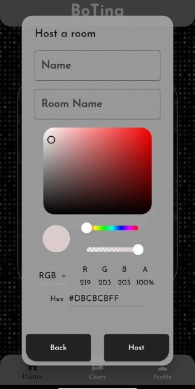

# BoTing - Anonymous Chatting App

BoTing is an innovative anonymous chatting app designed to provide users with a secure and private platform for group conversations. With a sleek dark-themed interface, the app emphasizes user anonymity and data privacy, ensuring a seamless and personalized chatting experience.

## Features

- **Anonymous Chatting:** Engage in conversations anonymously without revealing personal information.
- **Host and Join:** Create or join chat groups effortlessly.
- **Customizable Display:** Personalize your chat experience with preferred names and colors.
- **End-to-End Encryption:** Messages are protected with robust encryption for security.
- **Client-Side Data Storage:** Chat data is stored locally, giving users full control.
- **Dark Theme:** Enjoy an immersive chatting experience with a dark-themed interface.

## Screenshots

*Logo Screen*

*Main Screen*

*Chat Screen*

*Host Screen*

*Join Screen*

## Installation

1. Clone the repository: `git clone https://github.com/yourusername/boting.git`
2. Install dependencies: `flutter pub get`
3. Run the app: `flutter run`

## Contributing

Contributions are welcome! Please fork the repository and submit a pull request with your enhancements.

## License

This project is licensed under the [MIT License](LICENSE).

## Contact

For any inquiries or feedback, feel free to contact us at [email@example.com](mailto:email@example.com).

